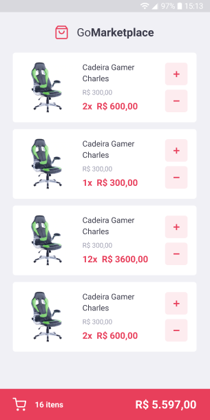

# GoMarketplace 🛒
The best place to buy new stuff.

<hr>




## How to run 🚀:
```bash
# Clone this repository
$ git clone https://github.com/EduardoBravoP/desafio-gomarketplace.git

# Go into the repository
$ cd desafio-gomarketplace

# Install dependencies
$ yarn

# Run the JSON Server
$ yarn json-server server.json -p 3333

# Run the app (iOS)
$ yarn ios

# Run the app (Android)
$ yarn android
```
